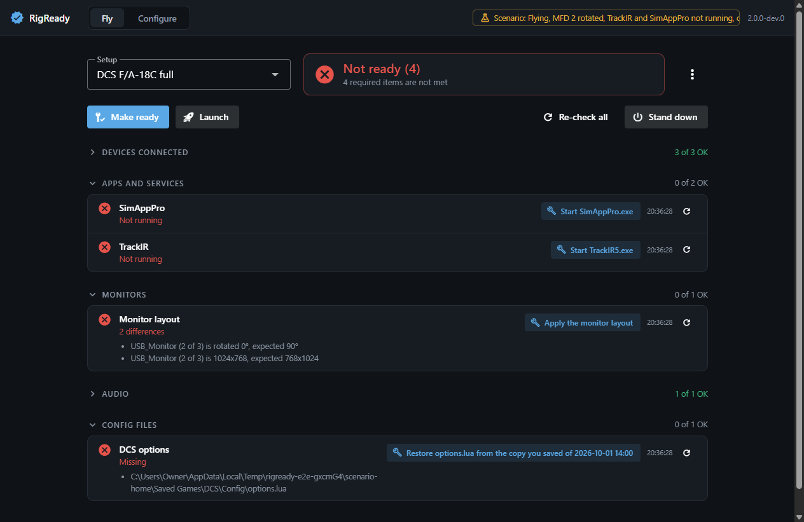
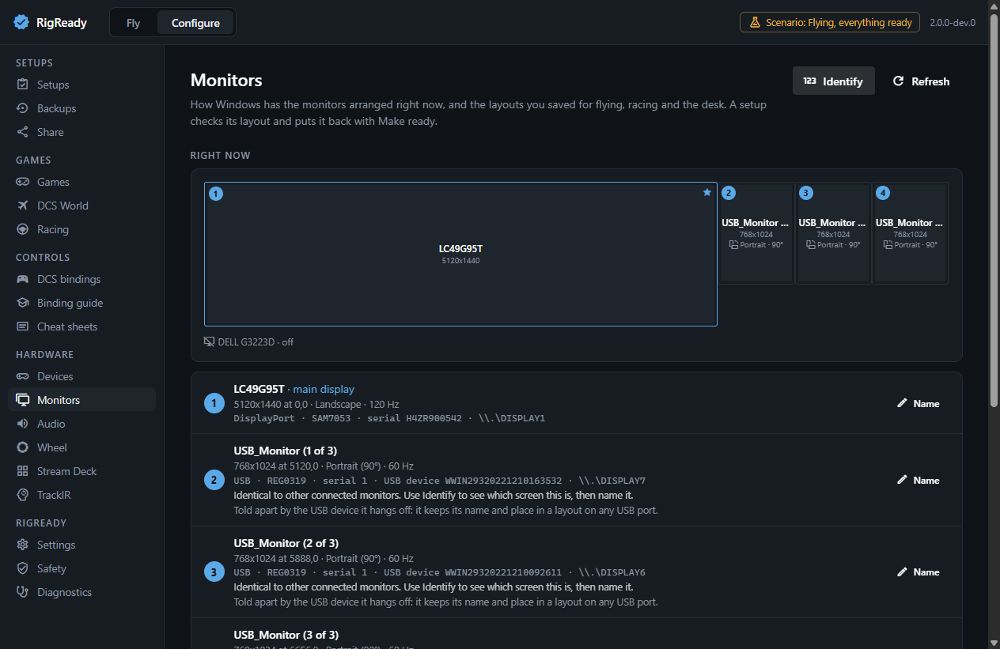
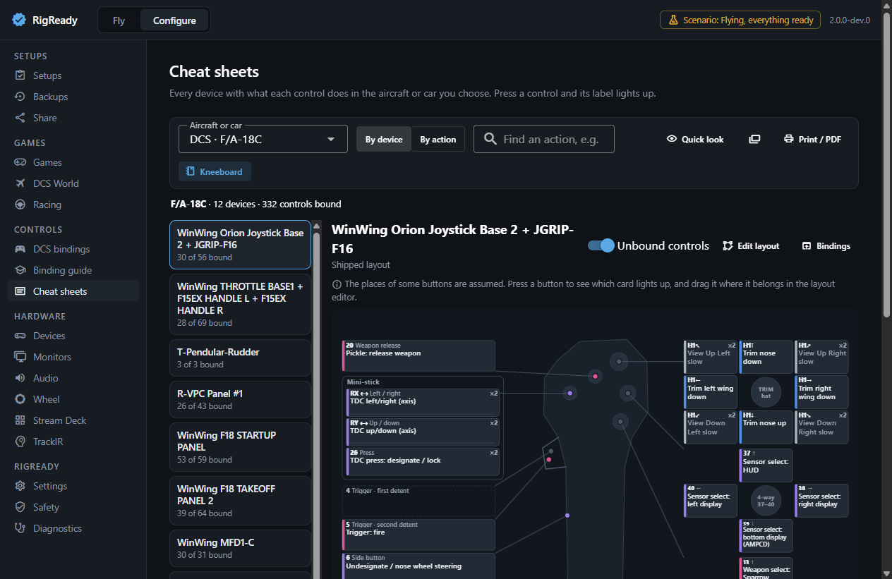

# RigReady

A Windows desktop app for flight and racing sim rigs. It checks that the rig is ready (devices plugged in, helper apps running, monitors arranged, audio and game files right), fixes what it can, and launches the game. It also manages bindings, backups and hardware troubleshooting.

Website: [rigready.io](https://rigready.io) · License: MIT



## Who it is for

People whose sim PC is also used for other things. Getting it ready to fly or race means the right hardware is plugged in, the right helper apps are running, the monitors are arranged correctly, and the game's bindings and settings are intact. When one of those is off, you usually find out after the game has loaded. RigReady tells you before, and puts it right.

## Status

Version 2.0.0 is a rebuild from the ground up. It is **pre-release**: nothing has been published yet, there is no installer to download, and the only way to run it today is from source (below). `docs/requirements/ledger.yaml` lists every requirement with its status and the evidence for it; `CHANGELOG.md` summarises what 2.0.0 contains and what is still open.

## What it does

- **Fly.** One screen with a checklist for the setup you used last. **Make ready** runs every fix in order (starts apps, applies the monitor layout, restores files). **Launch** starts the game and is never blocked, only warned. **Stand down** closes the helper apps and puts the monitors back to the desk layout. The same actions are in the tray menu.
- **Setups.** One per aircraft or car, created by capturing the rig while it works, then edited. Back up and restore bindings and settings; share a setup as a file with personal details reviewed and removed.
- **Controls.** See and edit DCS bindings, clean up the defaults DCS binds on every device, recover when Windows changes device IDs, copy common controls between aircraft. Cheat sheets with a picture of each device, printable and exportable as DCS kneeboard pages. A binding guide with a walkthrough, and optional AI help with your own Anthropic API key.
- **Hardware.** Every device, found by pressing a button on it; an input tester; a health check for stuck buttons and noisy axes; a USB map. Monitor layouts with identify and a timed revert. Default audio devices. Stream Deck, TrackIR and Fanatec wheel pages.

| | |
|---|---|
|  |  |
| Monitors: the arrangement now, and saved layouts | Cheat sheets: what every control does |

## Games and hardware

| | Support |
|---|---|
| DCS World | The deepest: installs (Steam and standalone), MFD screen setup (MonitorSetup), Export.lua, options, bindings (view, edit, clean up, device ID repair, copy between aircraft, snapshots), cheat sheets, kneeboard pages, binding guides for the F/A-18C and UH-1H. |
| iRacing, Le Mans Ultimate, BeamNG.drive, Assetto Corsa | Detection, a page per game with bindings and controllers as the game's files have them, backup and restore, checks for a racing setup. |
| Microsoft Flight Simulator 2024, Assetto Corsa EVO, Assetto Corsa Rally | A game module: detection, config locations, backup suggestions, launch. |
| Any other game | Works generically: a checklist, launch, tracked files, backup. |
| Hardware | Any USB game controller, monitor and audio device Windows sees. Dedicated pages for a Fanatec wheel base, Stream Deck and TrackIR; HidHide is noticed when it hides a device. WinWing devices work as controllers; features that need WinWing's own protocol (backlight sync, UFC/ICP displays, vibration) still need SimAppPro, and RigReady checks that it is running when a setup uses them. |

RigReady was built on one real rig. Nothing in the code is tied to it (a test enforces that), but most of the above has been proven only on recorded data from that rig and on generic test PCs. See the known limitations in `CHANGELOG.md`.

## Safety promises

- No file outside RigReady's own data folder is changed without an automatic backup first and a visible description of the change. Every change is listed on the Safety page and can be undone.
- A monitor layout that was applied goes back by itself unless you keep it.
- No administrator rights. The app never asks for elevation.
- No success message for something that did not happen.
- Shared setups never contain scripts or launch commands, and nothing from a setup is ever placed into a command line.

## Run from source

Windows 10 or 11, Node.js 22.12 or newer.

```
git clone https://github.com/MCheli/rigready.git
cd rigready
npm ci
npm run dev:scenario -- flying-all-good   # the app on a recorded rig; touches nothing real
```

To run against your own PC:

```
npm run setup:python   # once: the small Python runtime the controller reader needs
npm run dev            # uses the real machine and the real data folder
```

## Commands

| Command | What it does |
|---|---|
| `npm run dev:scenario -- <scenario>` | The app on a recorded rig in a temp folder. Without a name it lists the scenarios. |
| `npm run dev` | The app on the real machine and the real `~/.rigready`. |
| `npm run check` | Typecheck, lint, format check, unit tests with coverage, ledger check. |
| `npm run test:e2e` | Builds, then drives the app on recorded scenarios; screenshots go to `artifacts/screens/`. |
| `npm run rig:smoke` | Read-only checks against real hardware. |
| `npm run smoke:packaged` | Builds the unpacked app and tests it. |
| `npm run smoke:installer` | Builds a test installer, installs, updates and uninstalls it. |
| `npm run dist` | Builds the installer into `release/`. Never publishes. |

## Where data lives

Everything RigReady keeps is in `%USERPROFILE%\.rigready` (`~/.rigready`): setups (`profiles\*.yaml`), `settings.json`, monitor layouts, backups (`backups\`), the automatic copies made before each change (`backups\auto\`), the change journal and the log (`logs\rigready.log`). Set the environment variable `RIGREADY_HOME` to use another folder. Uninstalling keeps this folder unless you choose to remove it.

## Documents

| | |
|---|---|
| [`docs/USER-GUIDE.md`](docs/USER-GUIDE.md) | How to use the app, task by task. |
| [`CHANGELOG.md`](CHANGELOG.md) | What each version contains. |
| [`docs/PRODUCT.md`](docs/PRODUCT.md) | What the product is. Source of truth. |
| [`docs/ARCHITECTURE.md`](docs/ARCHITECTURE.md) | Layers, ports, test harness, safety rules. |
| [`docs/CONTRIBUTING-FEATURES.md`](docs/CONTRIBUTING-FEATURES.md) | How to add a feature, everything the shared foundation provides, and the audits a feature must pass. |
| [`CONTRIBUTING.md`](CONTRIBUTING.md) | How to contribute. |
| [`docs/RELEASING.md`](docs/RELEASING.md) | How a version is released, and the checklist before it is. |
| [`docs/requirements/ledger.yaml`](docs/requirements/ledger.yaml) | Requirements, status, evidence. |
| [`docs/research/`](docs/research/) | Findings on game file formats and hardware. |

## License

MIT. See [`LICENSE`](LICENSE).
