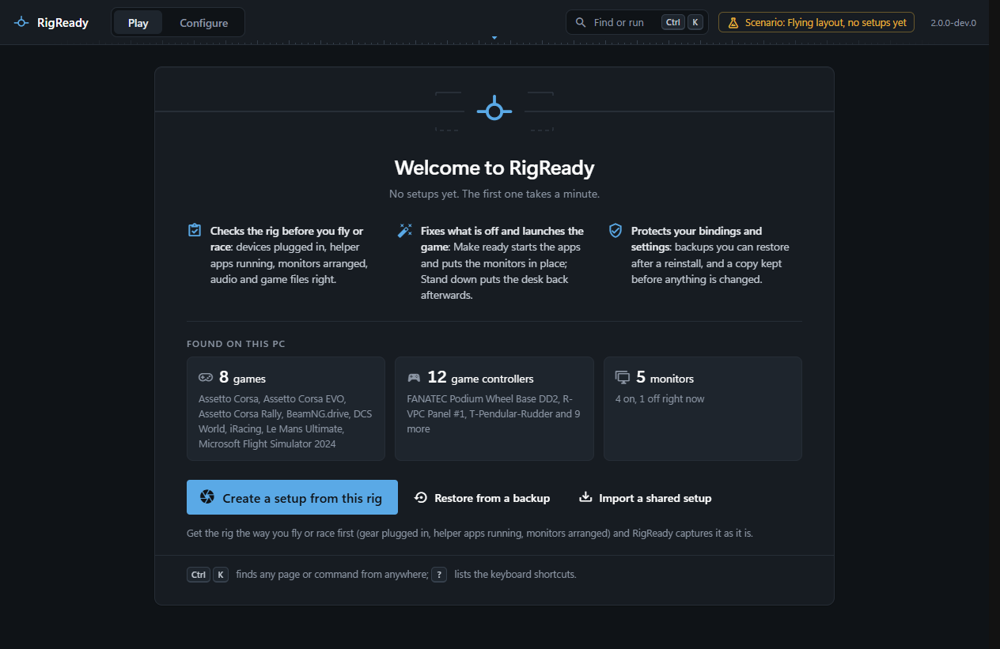
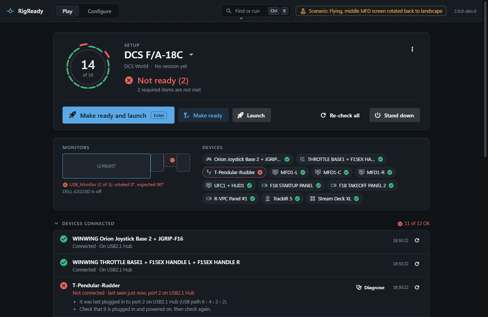
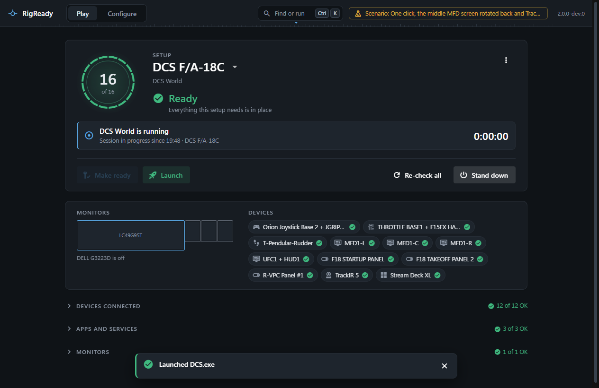
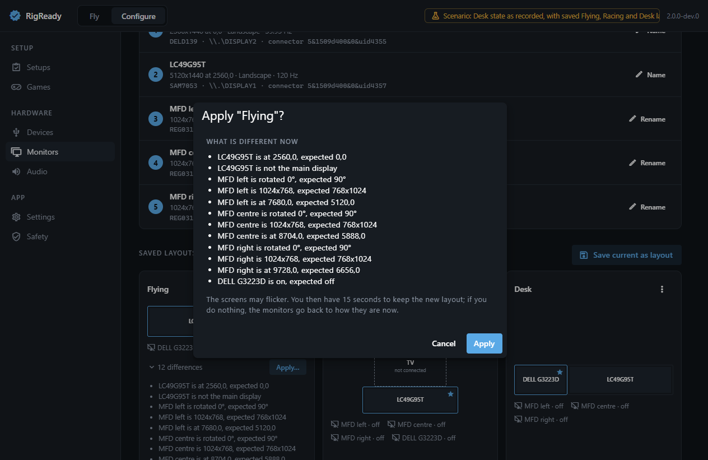
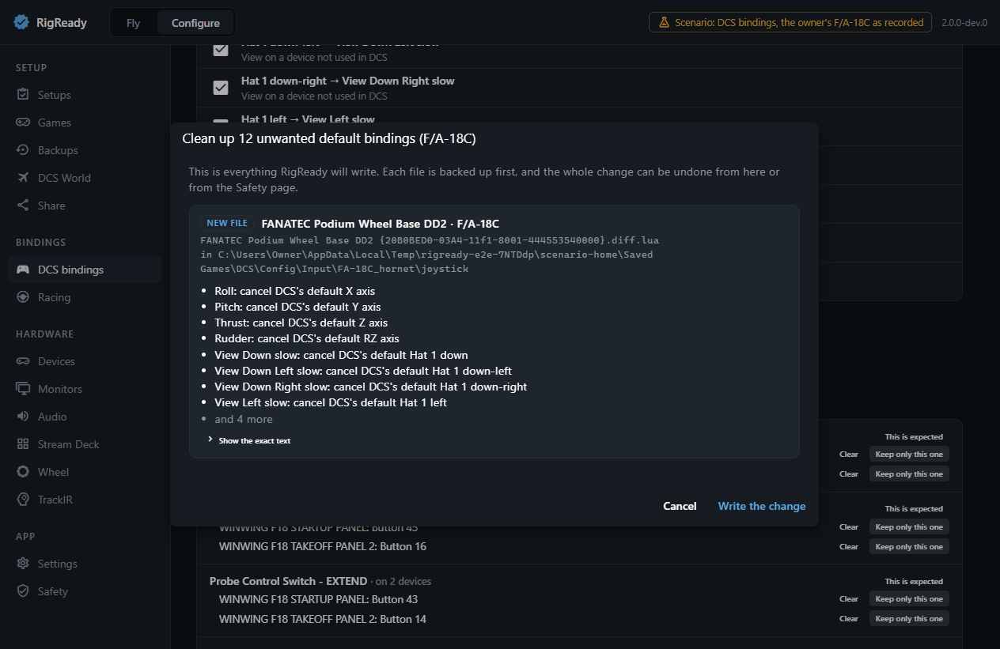
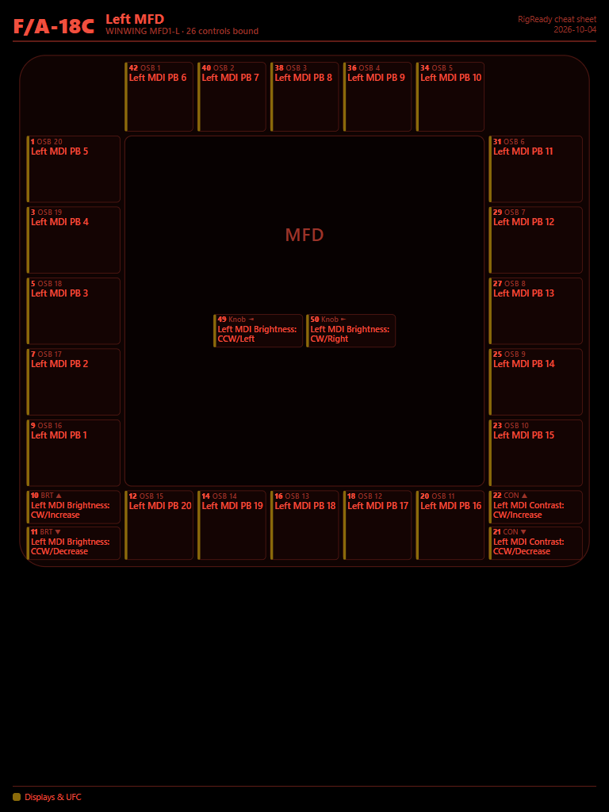
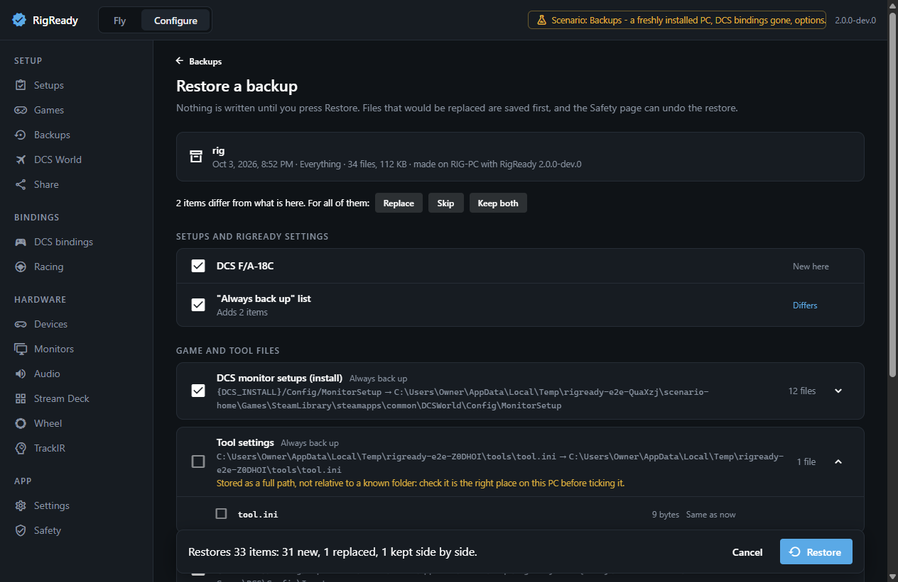
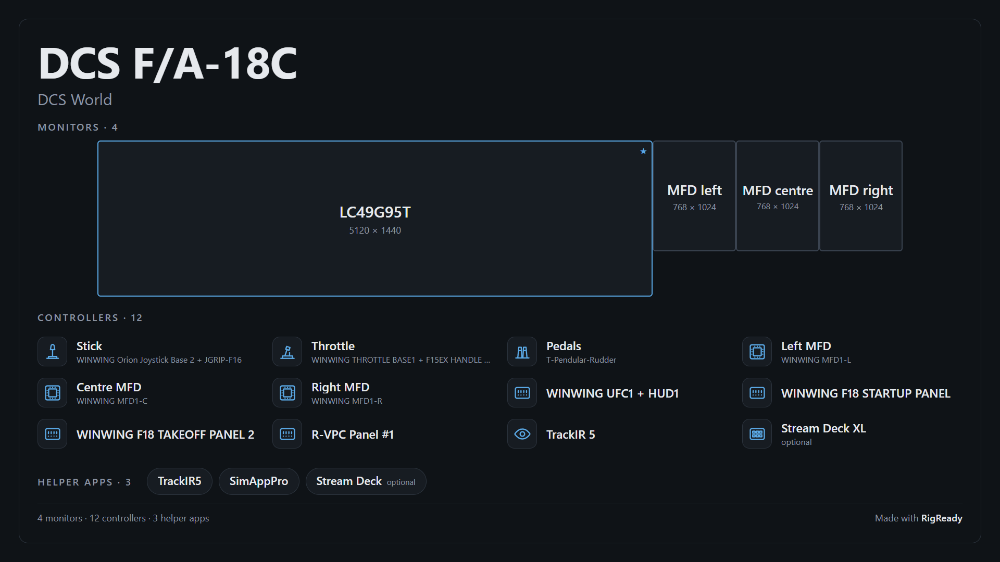
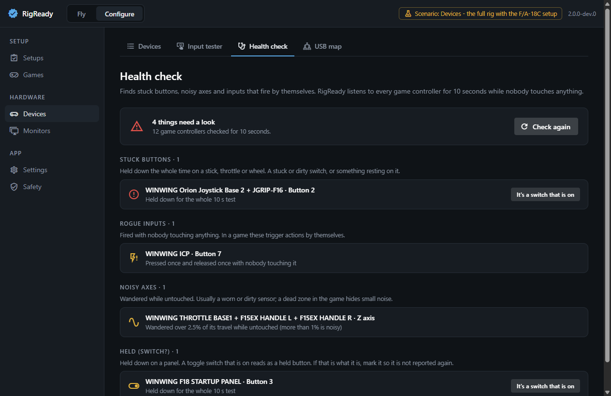

# RigReady user guide

RigReady has two modes, switched at the top left of the window.

- **Play** is one screen: is the rig ready, fix what is not, launch.
- **Configure** is everything else: setups, games, controls, hardware and the app itself.

Nothing outside RigReady's own folder is ever changed without a copy being kept first. Every such change is listed under **Configure > Safety**, with Undo.

## 1. Create your first setup

A setup is one "ready state": one aircraft or car, with the devices, apps, monitor arrangement, audio devices and game files it needs.

1. Get the rig the way you fly or race: gear plugged in, helper apps running, monitors arranged.
2. Open RigReady. On first run it shows what it found on the PC and a **Create a setup from this rig** button.
3. Pick the game. RigReady proposes the devices, apps, monitor layout, audio devices and game files to check. Untick what this setup does not need, and mark anything that is nice to have as optional.
4. Create the setup. It appears on the Play screen.

Later, **Configure > Setups** edits everything about a setup: its checks, their fixes, what Launch starts, steps to run before and after launch, and what Stand down closes. Setups can be cloned, and items can be copied from one setup to another. Each setup is a YAML file in `~/.rigready/profiles` that you may also edit by hand.

## 2. Before you fly or race

Open RigReady. The Play screen shows the setup you used last and checks it.

- The dial shows how many checks are met. Under it the monitors are drawn to scale and the devices are listed, so a problem shows as a place; choosing one jumps to its row in the checklist.
- A **red** item is required and not met: the rig is **Not ready**. A **yellow** item is optional and not met: the rig is still **Ready**, with warnings.
- Each failing item has its own fix button, and a re-check button.
- **Make ready and launch** (or Enter) does everything: it runs the fixes in order (monitors, audio, files, devices, apps, scripts) and launches the game once everything required is met. A monitor change asks you to keep it; if you do not answer, it goes back. If something still needs you, it stops, says what, and offers Launch anyway.
- **Make ready** and **Launch** are also there on their own. Launch is never blocked: if the rig is not ready, it tells you what is missing and asks first.
- While the game runs, the screen shows the session. When the game closes it says **Welcome back**, and **Stand down** becomes the main action: it closes the helper apps RigReady started and puts the monitors back to your desk layout.
- If the gear that is plugged in fits another setup better, the screen offers to switch to it.

The menu at the top right of the screen (⋮) has the rest: **Stand down when the game closes**, **Hide RigReady after Launch**, **History** (your sessions, and what needed fixing most often), **Compact view** (a small window that stays on top, with the dial and the main action) and an optional **Ready tone**.

The same actions are in the tray menu, and the tray icon shows whether the rig is ready.

### One double-click

Once a setup works, a session need not start in RigReady's window at all.

- **A desktop shortcut.** In **Configure > Setups**, edit the setup and choose **Create desktop shortcut**. Double-clicking "<setup name> - RigReady" starts RigReady, makes the rig ready (monitors, helper apps, files) and launches the game. If something required is missing, nothing is launched: RigReady's window comes forward and says what is missing. A monitor change still asks you to keep it.
- **The taskbar.** Right-click RigReady's taskbar button for **Launch <setup>**, with the setups you used last at the top. The button itself shows the state of the setup in use (a green dot, an amber triangle, a red square), fills while RigReady works, and has Make ready, Launch and Stand down under its thumbnail.
- **The tray.** Rest the pointer on the icon to read what is not met. One click brings the window out or puts it away, a double-click always opens it, and the right-click menu has every action.
- **A hotkey.** **Configure > Settings > Hotkey** lets you choose a key combination that works from anywhere: it brings RigReady forward and runs Make ready. It is off until you choose one, and it never launches.
- **The command line**, for a Stream Deck button or a script: `RigReady.exe --launch "<setup>"` makes ready and launches, `--make-ready "<setup>"` stops before launching, and `--setup "<setup>"` only shows the setup. A setup is named by its name or by its id.

## 3. Monitors

**Configure > Monitors** shows the arrangement to scale and your saved layouts.

- **Save current as layout** stores the arrangement under a name, for example Flying, Racing and Desk.
- **Apply** shows exactly what is different now, on a map that moves from how the monitors are to how they will be (Before and After flip it by hand), changes it, and gives you 15 seconds to keep the result.
- **Identify** puts a number and an arrow on every physical screen. Use it to name identical screens (left, centre and right MFD), and to say which way is up on a screen that is mounted sideways.
- Mark one layout as the **desk layout**. Stand down returns to it.

Identical USB screens are recognised by the serial number of their USB device, so they keep their names when moved to another port.

## 4. DCS World

**Configure > DCS World** has four tabs.

- **Overview**: installs, version, whether an update is waiting, and the state of everything below.
- **Screens**: put the main view and the MFD displays on your monitors, crop the bezels, and write the result. RigReady writes its own `RigReady.lua` under `Saved Games\DCS\Config\MonitorSetup` and selects it in `options.lua`. It never edits a file you or SimAppPro made. If SimAppPro has an MFD plan, the page starts from it.
- **Export.lua**: one line per tool (WinWing, DCS-BIOS, SRS, Tacview, DCS-ExportScript, Helios). Add or remove one without touching the others. If another program rewrites the file, RigReady notices and offers to put your lines back.
- **SimAppPro**: what RigReady does in its place, and which WinWing features still need it running.

Close DCS before writing. RigReady refuses to write DCS files while DCS is running.

## 5. DCS bindings

**Configure > DCS bindings** shows what every control does in an aircraft: DCS's own defaults plus your changes.

- **Devices** and **Actions**: browse, search, and edit. To bind, press the control on the device or pick it from the list. Changes are staged; **Review** shows them in plain language and as the exact file change before anything is written.
- **Problems**: one input on several actions, one action on several devices, default bindings DCS put on devices that should not have them, and important actions that are on no controller. Each has a fix with a preview.
- **Device IDs**: when Windows gives a device a new ID, DCS no longer finds its binding file. This tab finds such files and moves them to the new ID. With identical devices it asks you to press a button on each instead of guessing.
- **Copy**: take common controls from one aircraft to another.
- **Snapshots**: a named copy of an aircraft's bindings, a comparison with now, and restore.

Some actions can only be bound inside DCS for now. They are shown and marked, never hidden.

## 6. Cheat sheets and kneeboard pages

**Configure > Cheat sheets** draws each device with what every control does in the aircraft or car you choose: DCS aircraft, and iRacing, Le Mans Ultimate, BeamNG.drive and Assetto Corsa.

- Press a control on the device and its label lights up.
- **By action** answers "which control does this?".
- **Quick look** is a small window that stays on top, for a second monitor.
- **Learn** names an action and you press the control for it on the device. It says right or wrong at once with the control lit on the picture, brings missed ones back, and remembers what you know, per aircraft and per racing game.
- **Edit layout** lets you rearrange a device's picture, or put a photo behind it.
- **Print / PDF** makes one page per device plus a summary page.
- **Kneeboard** writes pages into the aircraft's DCS kneeboard folder, in a day or a night style. RigReady only ever replaces or removes pages it wrote itself.

## 7. The binding guide and AI help

**Configure > Binding guide** explains, for the F/A-18C and UH-1H, what the important controls do, when you use them, and where they belong. The walkthrough goes through them in order of importance and lets you press the control you want for each.

AI help is optional. Add your own Anthropic API key under **Settings**. You can then ask for a suggested setup on your devices, an explanation of an action, or a guide for another aircraft. Before each request RigReady shows exactly what will be sent. Nothing is applied until you tick it and review the file change.

## 8. Backups

**Configure > Backups**.

- **Back up now** puts every tracked file and every setup into one backup file.
- **Tracked files** lists what is backed up. Games and tools suggest their own files.
- **Restore** shows where each item will go on this PC and whether it is new, the same or different, and lets you replace, skip or keep both. What it replaces is saved first.
- **Snapshots** keep a named copy of one item, with a line-by-line comparison.
- **What changed** compares the game's files now with the last time the game was started.

On a new PC: install the games, restore a backup, then use **DCS bindings > Device IDs** if Windows gave the devices new IDs.

## 9. Sharing a setup

**Configure > Share** exports a setup as a `.rigready` file. A review lists every personal detail it found (user name, PC name, serial numbers, paths) and what will be done about each. Scripts and launch commands are never included; they are listed so the other person knows what to add. Importing shows what the setup needs that this PC does not have, and what it wanted to run.

**Save a picture of this setup** draws the rig as one image to show people, 16:9 or square: the monitors to scale, every controller with the name you gave it, and the helper apps. No serial number, user name, PC name or path is in it. The page shows the picture before you save it, and after saving it shows the file that was written.

## 10. Hardware

**Configure > Devices** has four tools.

- **Devices**: every game controller, with your own names. **Find a device** highlights whatever you press.
- **Input tester**: buttons, axes and hats as a game sees them, for one controller or all at once. Each axis draws a trace of the last few seconds with the range it has reached, two axes can be plotted against each other, and a button keeps a mark once it has been pressed.
- **Health check**: take your hands off for ten seconds. It reports stuck buttons, inputs that fire by themselves and noisy axes, each with what was recorded, how bad it is and what to do about it. **Copy as text** puts the findings on the clipboard.
- **USB map**: a drawing of what is plugged into what, from each USB controller of the computer through the hubs to every device. Click a device and the way to it is drawn through and said in words. It also says what can be unplugged for the current setup.

**Audio** sets and checks the default playback and recording devices. **Wheel**, **Stream Deck** and **TrackIR** have a page each; Stream Deck includes backup, restore and a guide for a new PC.

## 11. Racing and other games

**Configure > Racing** covers iRacing, Le Mans Ultimate, BeamNG.drive and Assetto Corsa: bindings as the game's files have them, the controllers each game knows, and backup and restore. **Configure > Games** lists every detected game. Any other game works with a setup of its own: a checklist, a launch target and tracked files.

Tuning values of a Fanatec wheel base are stored on the base. RigReady cannot read them; the Wheel page lets you record your presets by hand so there is a copy.

## 12. The app itself

- **Find anything**: Ctrl+K, or the button at the top right, opens one field that finds every page and runs the common actions from wherever you are: Make ready, Launch, Stand down, switch to another setup, apply a saved monitor layout, Back up now, find a device by pressing a button on it, open the bindings or the cheat sheet of an aircraft. What an action did is reported at the bottom of the window. Ctrl+1 and Ctrl+2 switch between Play and Configure, and `?` lists the keys.
- **About**: the version number at the top right opens it: the version, the licence, and where to report a problem.
- **Settings**: start with Windows, close to tray, update channel, AI key, notifications, retention of automatic backups.
- **Safety**: every change RigReady made to files outside its own folder, with Undo.
- **Diagnostics**: the log, and a button that copies a report with personal details removed.
- **Text size**: Ctrl and + makes everything in the window larger, Ctrl and - smaller, Ctrl+0 puts it back. F11 fills the screen.

## Things to know

- Close a game before restoring or editing its files. RigReady refuses to write while it runs.
- Features marked "not yet verified on real hardware" in the app have passed tests on recorded data but not on the real thing. `CHANGELOG.md` lists them.
- Everything RigReady keeps is in `~/.rigready`. Set `RIGREADY_HOME` to use another folder.
